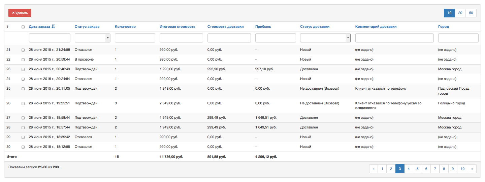

yii2-grid
=========
Simple extended ```\yii\grid\GridView```.

**Functional:**

- Wrapping GridView in [Bootstrap3 Panel](http://getbootstrap.com/components/#panels).
- Ability changing size of page.
- Column of 'Total' with ability using custom formulas.
- Hard-header.
- Custom tags of template the GridView.



Installation
------------

The preferred way to install this extension is through [composer](http://getcomposer.org/download/).

Either run

```
php composer.phar require --prefer-dist bupy7/yii2-grid "*"
```

or add

```
"bupy7/yii2-grid": "*"
```

to the require section of your `composer.json` file.


Usage
-----

